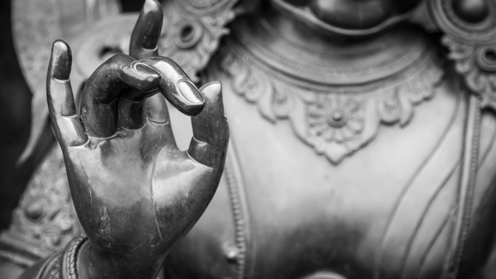

### Passi nel Dharma del Buddha

Sono Antonio Vigilante, autore de *La luna nell'acqua. Una mappa per perdersi nel Dharma del Buddha* e di *Le dimore leggere. Saggio sull'etica buddhista*. Questo spazio raccoglie tracce della mia ricerca sul Dharma del Buddha. *Pariyesana* in paali indica l'indagine, la ricerca, l'investigazione personale. 
