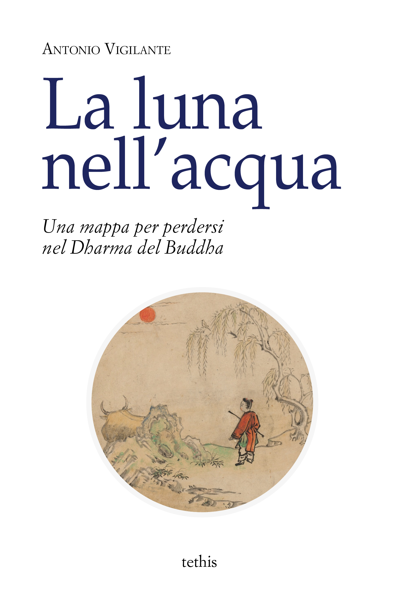

# La luna nell'acqua

Antonio Vigilante, _La luna nell'acqua. Una mappa per perdersi nel Dharma del Buddha_, Tethis, Torino 2019.  
Il caricamento del libro è incompleto. Ripassa tra qualche giorno per il libro integrale.

  

## Indice

[Introduzione](introduzione.md)  
[Nota](nota.md)    
[Una storia](una-storia.md)    
[Il male](il-male.md)    
[Psicoterapia](psicoterapia.md)  
[Tarkus](tarkus.md)   
[Io, anzi no](io-anzi-no.md)    
[Havel havalim](havel-havalim.md)   
[Il vaso magico](il-vaso-magico.md)  
[Il carro](il-carro.md)  
[Il gioco](il-gioco.md)  
[Al mercato, con le mani aperte](al-mercato.md)  
[Le viscere del Buddha](le-viscere-del-Buddha.md)  
[Lo scassinatore](lo-scassinatore.md)  
[Quale vittoria?](quale-vittoria.md)  
[Il Maestro e Margherita](il-Maestro-e-Margherita.md)  
[Io sono Dio](io-sono-Dio.md)  
[Fermarsi](fermarsi.md)  
[L'uomo dalla collana fatta di dita](angulimala.md)  
[Mendicanti](mendicanti.md)  
[Miracoli](miracoli.md)   
[La zattera](la-zattera.md)   
[Qui](qui.md)  
[Il silenzio](il-silenzio.md)  
[Verificare da sé](verificare.md)  
[La felicità](felicita.md)  
[Il fuoco](il-fuoco-md)  
[Il disincanto](il-disincanto.md)  
[Rinascere](rinascere.md)  
[Il karman](il-karman.md)  
[L'intenzione](intenzione.md)  
[Semi e frutti](semi-e-frutti.md)  
[La ruota](la-ruota.md)  
[La bambola rotta](la-bambola-rotta.md)  

